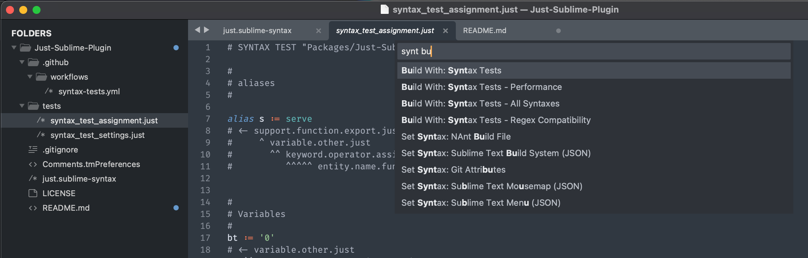
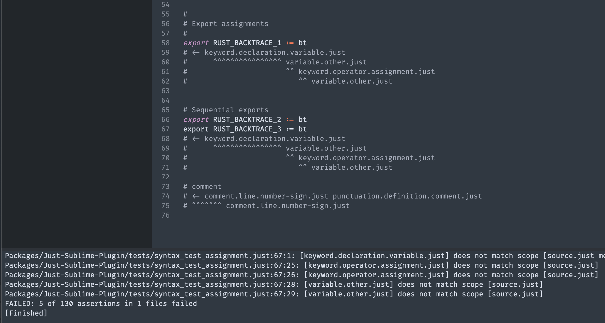

# Just-Sublime-Plugin
Syntax highlighting for the [Just task runner](https://just.systems).

## Contributing
This is an open source plugin, and your PRs are welcome!

### Installing the package
To try this on your own macOS or Linux system, make sure you have [Sublime installed](https://www.sublimetext.com/download). Then [fork this repo](https://github.com/nk9/Just-Sublime-Plugin/fork), download your fork, and symlink it into place:

```bash
~ $ git clone https://github.com/<YOUR-GITHUB-HANDLE>/Just-Sublime-Plugin.git
~ $ cd Just-Sublime-Plugin
Just-Sublime-Plugin $ ln -s $PWD ~/Library/Application\ Support/Sublime\ Text/Packages/Just-Sublime-Plugin
```

Now the package is installed. You don't have to relaunch Sublime, although you will need to re-open any .just files that are already open.

### Running tests
Sublime contains a [built-in syntax testing system](https://www.sublimetext.com/docs/syntax.html#testing). In fact, it will run whenever code is pushed to GitHub. But before you push any changes, you will want to make sure the tests are running correctly on your local system. To do that, make sure the plugin (with the syntax definiton) is installed as above. Then open one of the `syntax_test_` files in the `tests` directory. Open the Command Palette (<kbd>Cmd</kbd>+<kbd>Shift</kbd>+<kbd>P</kbd>) and run the `Build With: Syntax Tests` command.



This will open the console and show you the result of the tests.



In this case, the test on line 67 is failing both at column 1, and also in columns 25, 26, 28, and 29.

## Documentation and Tools

- Sublime has some pretty good [syntax documentation](https://www.sublimetext.com/docs/syntax.html)
- The [ScopeHunter package](https://packagecontrol.io/packages/ScopeHunter) is on PackageControl, and it is essential. With the Instant Scoper, you will get the scope under the cursor as you move around the file.
- Sublime has a bunch of [default syntax definitions](https://github.com/sublimehq/Packages/blob/master/Python/Python.sublime-syntax) which you can view and copy. This is particularly helpful for determining which scopes to use in a given case.
- This is a good blog post covering [Sublime syntax](https://haggainuchi.com/sublime.html)
- There is a really useful [thread on GitHub with tips and advice](https://github.com/sublimehq/Packages/issues/757) for building Sublime syntax definitions
- Lastly, the [Sublime Forum](https://forum.sublimetext.com) has several users who are very knowledgeable and active with syntax questions. Searching the archives can also be a big help.
